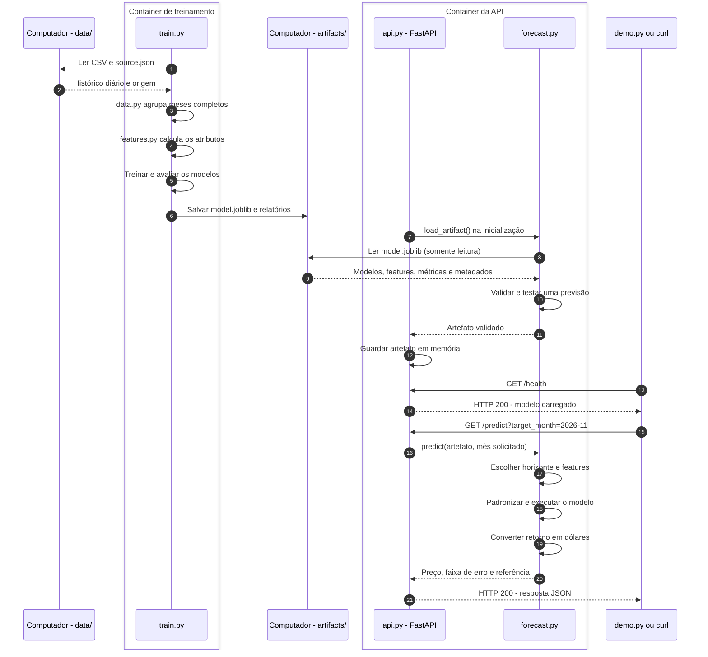
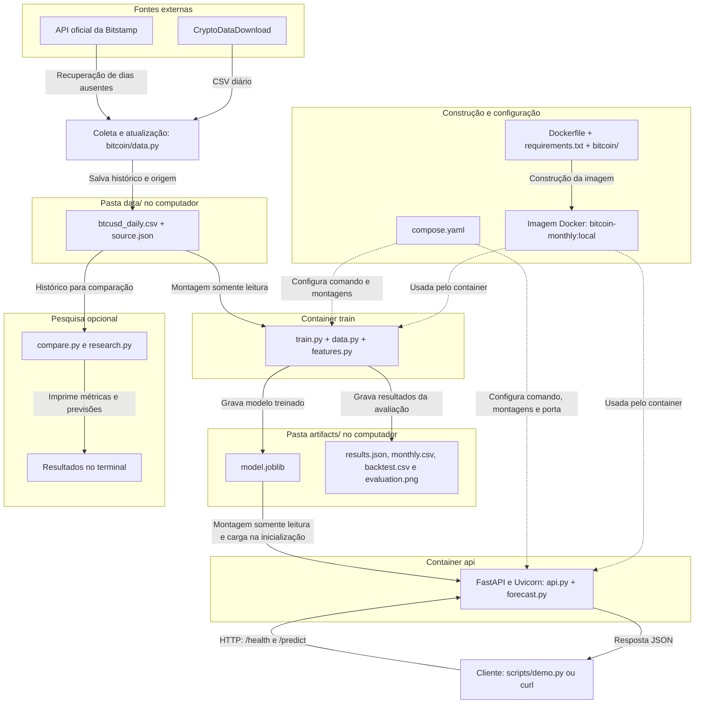

# Bitcoin: previsão mensal com Docker

**Autora:** Lorena Gabriela da Silva Garcia

**Atividade:** [modelo de predição com Docker - M7/2026](https://github.com/Murilo-ZC/Atividade-Ponderada-M7-2026-EC)


## **Dev Log**

- A ideia é fazer uma Solução em Python que usa o histórico diário de **BTC/USD desde janeiro de 2020**, escolhi essa data por ter sido um dos maiores ganhos percentuais da historia do Bitcoin e um ano em que aconteceu o penultimo halving da moeda, o fornecimento da previsão ocorre pelo backend FastAPI, por eu estar mais acostumada.

- O resultado previsto é o preço de fechamento, em dólares, do último dia do próximo mês calendário**. A referência desta entrega é 05/10/2026: o mês desejado é novembro de 2026, com fechamento em 30/11/2026. 

- Eu tô usando os dados do CryptoDataDownload, porque já usei em outro projeto. O CSV contém 2.469 dias, de 01/01/2020 a 04/10/2026(última dia observado integralmente), durante a execução pedi para a AI verificar o arquivo, ela descobiu que faltava o registro do dia 22/05/2026, daí a solução que ela deu foi puxar da API oficial da Bitstamp, que é a exchange que a CryptoDataDownload pega o arquivo.

- Eu pedi para a AI, gerar o arquivo de verificação dos dados, era pra ser uma EDA, mas ela me explicou que seria interessante a gente olhar pra coleta, verificação e agrupamento pensando em mês. Sobre o agrupamento dos dados do modelo com as informações que a gente conversou que seriam mais relevantes dentro de uma predição de mercado pensando em mẽs, verificamos que haviam essas dispostas no modelo:
    - Abertura: Primeira abertura do mês
    - Máxima: Maior preço máximo entre os dias
    - Mínima: Menor preço mínimo entre os dias
    - Fechamento: Último fechamento do mês
    - Volume: Soma do volume negociado
    - Volatilidade: Desvio padrão dos retornos logarítmicos diários

Com isso, ele criou o [/home/lorena/Docker-ponderada/bitcoin/data.py]

- Daí começamos a preparar as features, e conversando a gente percebeu que seria legal usar as principais abaixo:

| Atributos | Informação representada |
|---|---|
| Retornos de 1, 3 e 6 meses | Quanto o preço mudou em diferentes períodos |
| Distância das médias de 3 e 6 meses | Quanto o fechamento está acima ou abaixo da média recente |
| Amplitude relativa do mês | Diferença entre máxima e mínima, dividida pelo fechamento |
| Volatilidade diária | Intensidade das oscilações dentro do mês |
| Mudança do volume em escala logarítmica | Alteração da atividade negociada |
| Tempo desde o último halving | Posição temporal em relação ao evento |
| Subsídio por bloco em BTC | Quantidade de novos bitcoins por bloco naquele período |

- E uma parte que eu queria considerar era o halving. Ele aparece nessas duas últimas features da tabela: o tempo desde o último evento e a quantidade de bitcoins novos por bloco
Com isso, ele criou o [/home/lorena/Docker-ponderada/bitcoin/features.py]

- E aí de fato quando terminamos essas duas fases iniciais dos dados, fomos para o treinamento, meu prompt:
`“Com os dados mensais e as features prontas, prepare os exemplos de treinamento. Cada exemplo deve usar as informações disponíveis até determinado mês para prever um fechamento futuro. Considere horizontes de um e dois meses, descarte linhas sem histórico suficiente e evite usar informações futuras nas entradas.”`

- Discutindo com a AI, acabei escolhendo a regressão Ridge. Depois de agrupar os dados por mês, sobraram poucos exemplos pra treinar, e algumas features tinhas umas informações que a gente viu que estavam parecidas. A regularização da Ridge ajuda a controlar o quanto o modelo se ajusta ao histórico. Mas isso não garante que ele vá prever bem o Bitcoin, então depois precisamos conferir os resultados:
`"Implemente o treinamento usando regressão Ridge. Antes do modelo, padronize os atributos com StandardScaler, ajustado somente nos dados de treinamento. Treine um modelo para cada horizonte, de um e dois meses. Mantenha o código simples e explique a função da regularização"`

Ahh e um pouco da minha conversa com ele: 

"Depois do agrupamento, temos apenas 81 meses completos, e uma parte das linhas ainda é descartada por falta de histórico ou de resultado futuro. Portanto, o conjunto de treinamento é pequeno.
Além disso, alguns atributos carregam informações relacionadas, como os retornos de um, três e seis meses.
A Ridge aprende uma relação linear entre os atributos e o retorno futuro, mas acrescenta uma penalização que desestimula coeficientes muito grandes. Essa é a regularização, usada para controlar o ajuste ao histórico.
O parâmetro alpha controla a intensidade dessa penalização: valores maiores penalizam mais os coeficientes. Isso não garante previsões melhores; a avaliação posterior verifica o desempenho."

- Antes de guardar o modelo, também entrou a parte de avaliar como ele estava prevendo. O código compara alguns valores de alpha, na ordem dos meses, e depois simula previsões para 12 meses com resultado conhecido. E é basicamente assim que é o fluxo de treinamento e teste dele. A comparação foi entre a Ridge com halving, sem halving e uma previsão simples que repete o último fechamento. E aí apareceu uma limitação: nesse teste, repetir o último fechamento teve menos erro, e incluir o halving não melhorou a Ridge. Então o sistema funciona, mas o modelo ainda não mostrou vantagem nessa comparação

- Depois do treinamento precisavamos guardar o que o modelo aprendeu em um arquivo .joblib [/home/lorena/Docker-ponderada/artifacts/model.joblib], basicamente ele une as informações necessárias pra prever e o resultado é guardado em results.json, para ser verificado e buscado depois. Quem a API carrega pra fazer a previsão é o model.joblib.

- Com isso pronto, pensamos na API: api.py carrega o model.joblib quando o FastAPI inicia. Quando alguém consulta /predict, a aplicação chama a função de previsão em forecast.py, usa o modelo em memória e devolve o resultado em JSON. A rota /health permite verificar se o serviço conseguiu carregar um modelo utilizável.

- Ahh esqueci de falar do `forecast.py`, ele basicamente é a lógica de carregar o modelo salvo e calcular a previsão. 

`"Crie uma API em FastAPI que carregue o modelo treinado na inicialização, disponibilize a previsão em /predict e tenha uma rota /health para verificar se está pronta."`

- E agora entra o **Docker**. 
    - O **Dockerfile** define a imagem com Python, bibliotecas e código. A imagem funciona como a base para criar os containers. O container é a execução dessa base, com um processo rodando dentro dele;
    - O **Compose**, vai organizar os serviços da imagem que a gente criou 
        
        - Seguinte, o `train.py` é treino e o `api.py` é o arquivo que com o FastAPI recebe as consultas. 

        `"Configure um serviço Docker para executar o treinamento e outro para servir a API. Compartilhe a pasta dos artefatos para que a API consiga carregar o modelo produzido pelo treinamento"`

        - E agora vai ser a primeira vez que vou dar uma destacada no meu prompt, basicamente a pasta compartilhada resolve como o modelo chega à API. O treinamento grava em artifacts/, que está montada dentro do seu container. A API acessa essa mesma pasta somente para leitura. Quando o container de treinamento termina, o arquivo continua no computador. Po, mas Lorena de onde você tirou isso? Lembra de quando eu falei do `model.joblib`? Basicamente eu guardo ele na pasta **artifacts**. Eu achei que usar o bind mount, ia ser interessante pra aplicar mesmo o projeto e colocar o conhecimento em prática, porque essa pasta consegue aparecer dentro do container e pra essa ponderada pareceu fazer mais sentido que o volume pelo contexto, apesar de que ele também serviria. 
        
        - Ahh e mais conceitos da aula, acabei esquecendo da minha primeira pontuação, mas enfim: O treinamento precisa escrever porque produz o modelo. A API só precisa ler porque utiliza o modelo pronto. Por isso, apenas a montagem da API recebe o read only, por isso são figuradas de maneira diferente. A pasta /data também fica somente para leitura no treinamento, porque ele só precisa consultar os dados.

        - Deixa eu explicar melhor o que tem no Dockerfile e no Compose. Eu pedi pra AI organizar essa parte em dois arquivos: o `Dockerfile` prepara a imagem com o ambiente do projeto, e o `compose.yaml` configura como os containers vão executar.

       
    - Ahh, e mais uma coisa: mesmo tendo dados diários até outubro, esse mês ainda não terminou, tipo, hoje é dia 5 e temos até dia, mas como eu queria ter um mês zerado, to prevendo o fim de novembro. Então o último fechamento mensal que o modelo conhece é setembro. Pra chegar em novembro, ele precisa prever dois meses à frente, e é por isso que esse horizonte aparece no treinamento.
- Belezinha, agora vamos executar o comando:
    
    `docker compose build # contruir a imagem `
    
    `docker compose --profile training run --rm train # executar o treinamento`
    
    `docker compose up -d --wait api # iniciar a api`
    
    `python3 scripts/demo.py # fazer uma consulta, to usando o demo.py basicamente porque ele consulta os 2 endpoints /health e /predict` 

- Seguinte, executei aqui, deu bom, a saída mostra que a imagem foi construída, o treinamento terminou e o cliente recebeu uma previsão pela API. Fixa.

    - Ahh quando eu executei o build apareceu bastante Using cache, porque o Docker conseguiu reaproveitar etapas que já estavam prontas. 

    - O treinamento terminou e mostrou a previsão de US$ 83.568,56 para 30/11/2026. Depois, o Compose indicou que a API estava Healthy. Rodei o demo.py, que fez as consultas por HTTP: o /health respondeu status: ok e model_loaded: true, e o /predict devolveu a previsão em JSON. Com isso, consegui verificar a comunicação entre o cliente e o backend (eu to resumindo porque se você executar vai dar um json gigante)

- Ahh e as métricas? 

    - *Executemos:*  `curl --fail http://localhost:8000/metrics | python3 -m json.tool`

    -   No teste de dois meses, ele acertou a direção em 3 das 12 previsões, ou 25%, e teve um erro percentual médio absoluto de 23,45%. Então a integração funciona, mas o modelo ainda apresentou bastante erro e ficou atrás da previsão simples que repete o último fechamento

    - Pedi pra AI concretizar em uma tabela com as metricas simples que eu vi em matemática e eu já conheço:

        | Métrica | Resultado |
        |---|---:|
        | MAE  | US$ 17.897,24 |
        | RMSE  | US$ 20.179,91 |
        | MAPE  | 23,45% |
        | Acerto da direção | 25% |

- Vamos melhorar o modelo, conversando com a AI. Depois que o modelo estava funcionando, eu quis entender se dava pra melhorar as previsões. Meu prompt:

`"Compare alternativas para melhorar o modelo, mantendo o código simples e usando os mesmos dados mensais. Teste a Ridge com e sem os atributos de halving, variações na configuração e um modelo de árvores. Compare também com a persistência, que repete o último fechamento conhecido.
Respeite a ordem temporal e ajuste o StandardScaler somente nos dados de treinamento. Use o MAE em dólares como critério principal, mas apresente também RMSE, MAPE e acertos de direção.
Escolha as configurações usando o recorte de desenvolvimento até agosto de 2025. Depois, mostre a comparação retrospectiva no período mais recente, explicando as limitações. Registre também as tentativas que pioraram e permita reproduzir os experimentos em Docker."`

 - Na comparação dos 12 meses de outubro/2025 a setembro/2026, o erro médio de um mês caiu de US$ 10.701,99 para US$ 10.118,93, uma redução de 5,45%. O erro percentual caiu de 14,18% para 13,50%, e os acertos de direção passaram de 4 para 5 em 12 previsões.
- Foi uma melhora pequena. Como esses meses já tinham sido analisados, precisamos de meses novos pra conferir se a melhora se mantém. A previsão de novembro continuou igual, porque ela usa o modelo de dois meses.
- Depois da primeira tentativa de melhoria, eu quis pesquisar outras possibilidades. A ideia era entender se alguma mudança no treinamento conseguiria diminuir os erros e continuar sendo simples de explicar. Meu prompt: 

`"Pesquise alternativas para melhorar a previsão mensal do Bitcoin, mantendo o projeto simples e os dados atuais. Compare a Ridge com outros modelos, uma janela de treinamento recente e uma combinação com a persistência.
Respeite a ordem temporal, sem usar informações futuras. Avalie 30 meses divididos em cinco blocos, usando MAE como critério principal e mostrando também RMSE, MAPE e acertos de direção.
Só substitua o modelo se superar a Ridge atual e a persistência no erro total e em pelo menos três blocos.”` 

- Basicamente, a AI pesquisou e comparou oito abordagens, incluindo a Ridge atual, outros regressores e o uso de meses mais recentes. Mas mesmo os candidatos com menor erro performaram menos que o modelo anterior. Além disso, no desenvolvimento, cada candidato venceu as duas referências em apenas um dos cinco blocos. Como a regra exigia pelo menos três, mantivemos os modelos da API.
- A pesquisa ficou no research.py, permitindo repetir os experimentos. A execução local e em Docker produziu resultados idênticos, e os 50 testes passaram.
- A previsão de novembro continuou em US$ 83.568,56. Os candidatos ficaram registrados para acompanhamento, porque uma melhora no histórico ainda precisa ser confirmada em meses novos. Sendo esse o cenário mais positivo. 
- No final, o Bitcoin realmente é uma moeda dificil de entender e tentar predizer então o resultado não foi insatisfatorio.

- A parte final foi concretizar tudo na arquitetura e em um diagrama de sequencia, como a AI e eu construímos a solução, pedi pra ele usar o contexto dele e eu revisei o diagrama:

`"Crie um diagrama de sequência UML em Mermaid para representar meu projeto de previsão do Bitcoin. Mostre o treinamento lendo o CSV, preparando os dados, treinando os modelos e salvando o artefato em uma pasta compartilhada. Depois, mostre a API carregando esse arquivo e respondendo às consultas do cliente. Identifique os dois containers, os arquivos envolvidos e os acessos somente para leitura. Explique a ordem das operações e como o modelo chega ao backend, mantendo a explicação simples."`

- Daí eu pedi pra AI criar dois diagramas pra mostrar como essas partes se conectam. O de sequência mostra a ordem em que as coisas acontecem, e o de blocos mostra onde ficam os arquivos e os containers.

- O de sequência, primeiro eu executo o treinamento. Ele lê o histórico salvo, usa o `data.py` pra agrupar os meses completos e o `features.py` pra calcular os atributos. Depois, o `train.py` treina, avalia e salva o modelo em `artifacts/model.joblib`.

Com isso pronto, eu inicio a API. O `api.py` usa o `forecast.py` pra carregar e verificar esse arquivo, e o conteúdo fica guardado na memória. Quando eu consulto `/health`, verifico se ela está pronta. Daí, quando peço a previsão em `/predict`, o `forecast.py` escolhe o modelo do horizonte solicitado, aplica a padronização e transforma o retorno previsto em preço em dólares. A resposta volta em JSON.

- Já no diagrama de blocos, eu consigo enxergar a organização do projeto. O `Dockerfile` cria uma imagem com Python, as bibliotecas e o código. O Compose usa essa mesma imagem pra executar dois containers: um faz o treinamento e termina; o outro mantém a API funcionando.

A ligação entre eles é aquela pasta compartilhada `artifacts/`. O treinamento grava o modelo nela e a API acessa com o read only, que significa somente leitura. Como essa pasta fica no meu computador, o arquivo continua salvo depois que o container de treinamento termina.

A API usa o modelo que carregou na inicialização. Então, se eu atualizar os dados e treinar de novo, preciso reiniciar a API pra ela passar a usar o novo arquivo.

## Arquitetura e arquivos






O [diagrama em PlantUML](docs/architecture.puml) descreve a coleta, o container de treinamento, o artefato, o container de inferência e o cliente. O serviço `train` grava `artifacts/model.joblib` em uma pasta compartilhada do host; o serviço `api` monta essa mesma pasta somente para leitura e carrega o modelo na inicialização. Os dois serviços usam a mesma imagem Python e executam processos separados.

| Caminho | Função |
| --- | --- |
| `bitcoin/data.py` | Baixar, validar e agregar o histórico; registrar sua origem. |
| `bitcoin/features.py` | Criar atributos de mercado e halving. |
| `bitcoin/train.py` | Treinar, avaliar e exportar os modelos e relatórios. |
| `bitcoin/forecast.py` | Carregar o artefato e calcular as previsões dos horizontes suportados. |
| `bitcoin/api.py` | Carregar o artefato e responder às requisições HTTP. |
| `scripts/demo.py` | Demonstrar uma requisição ao backend. |
| `data/btcusd_daily.csv`, `data/source.json` | Histórico diário e procedência do recorte utilizado. |
| `artifacts/` | Modelo, agregados mensais, previsões e avaliação. |
| `Dockerfile`, `compose.yaml` | Construção da imagem e execução dos dois serviços. |
| `tests/` | Verificações de preparação dos dados, modelagem e API. |

O diretório inicial não continha arquivos de aplicação antigos para remover. Os arquivos adicionados atendem à coleta, treinamento, inferência, documentação ou verificação; ambiente virtual e caches ficam fora da entrega.

## Dados e agregação

A fonte é o [CryptoDataDownload, histórico da exchange Bitstamp](https://www.cryptodatadownload.com/data/bitstamp/), no par BTC/USD. O arquivo diário contém preços de abertura, máxima, mínima e fechamento e volume negociado em BTC. As datas são calculadas pela coluna Unix em UTC; a coluna textual de datas do fornecedor não é utilizada. O CSV e os metadados de origem permitem repetir o treinamento sem novo download. A coleta inclui o endereço da fonte, o período efetivo e os hashes dos arquivos em `data/source.json`.

Foi identificada uma lacuna real no CSV original: **22/05/2026**. Esse candle foi recuperado pela [API oficial da própria Bitstamp](https://www.bitstamp.net/api/), com conferência de par e timestamp UTC. A resposta original, o endereço consultado e o hash constam em `supplemental_candles` nos metadados. A coleta verifica a continuidade dos dias e só completa lacunas com observações reais dessa mesma exchange.

O recorte desta execução começa em **01/01/2020**. A data de referência exclui o dia ainda em andamento e meses incompletos. Para `--as-of 2026-10-05`, o histórico diário vai até **04/10/2026**, e o último mês que pode entrar como observação mensal completa é **setembro de 2026**.

Cada mês agrega a primeira abertura, a maior máxima, a menor mínima, o último fechamento e a soma do volume diário. Também são calculadas a média dos fechamentos diários e a volatilidade dos retornos logarítmicos diários. O alvo usa o último fechamento, **não a média dos preços do mês**. A sequência temporal, os valores e a cobertura dos meses são verificados antes do treinamento; não há preenchimento de lacunas com preços inventados.

## Modelo, horizonte e halving

A abordagem utiliza `StandardScaler` e regressão `Ridge` em um mesmo pipeline. A regularização limita a complexidade para uma amostra mensal pequena. O modelo prevê o retorno logarítmico entre o mês de origem e o mês alvo; a conversão de volta para dólares usa o fechamento conhecido na origem:

```text
retorno_alvo = log(fechamento_alvo / fechamento_origem)
previsão_USD = fechamento_origem × exp(retorno_previsto)
```

Existem dois modelos diretos: horizonte de **1 mês** e de **2 meses** após o último mês completo. Isso evita tratar outubro parcial como um fechamento já conhecido. Na referência de 05/10/2026, setembro é a origem, outubro usa o horizonte 1 e **novembro usa o horizonte 2**, sem alimentar uma previsão de outubro como se fosse um dado observado.

Os oito atributos de mercado são retornos de 1, 3 e 6 meses; distância do preço às médias de 3 e 6 meses; amplitude mensal dividida pelo fechamento; volatilidade diária; e mudança do logaritmo do volume. Todos usam informações disponíveis até o mês de origem. Os seis primeiros meses servem de aquecimento para os atributos defasados.

As duas variáveis de halving são **meses desde o último evento** e **subsídio por bloco em BTC**. Elas representam apenas eventos já ocorridos nessa data, sem antecipar o conhecimento do evento em meses anteriores. O histórico a partir de 2020 contém os halvings de **11/05/2020** e **20/04/2024 (UTC)**; o evento de 2016 serve de referência no início da série.

O [protocolo Bitcoin reduz o subsídio por bloco a cada 210.000 blocos](https://developer.bitcoin.org/devguide/block_chain.html). Essa regra não fixa uma data exata para o próximo evento e não demonstra que ele cause uma valorização. O treinamento compara o modelo com halving com a mesma abordagem sem essas variáveis, para verificar o efeito empírico nesta amostra.

## Avaliação sem usar dados futuros

O teste usa os **12 meses alvo finais disponíveis**, com janela de treinamento crescente e um novo ajuste para cada origem. Uma linha só pode treinar o modelo se seu resultado já estiver conhecido na data daquela previsão; essa regra também vale para o horizonte de dois meses.

O parâmetro `alpha` da Ridge é escolhido entre `1`, `10`, `100` e `1000` com validação temporal interna: três divisões de quatro meses e separação compatível com o horizonte. A padronização é ajustada apenas nos dados de treino de cada divisão. A escolha não usa o erro dos meses do teste externo.

São registrados **MAE e RMSE em USD** para o modelo com halving, o modelo sem halving e uma referência simples que repete o último fechamento conhecido. O modelo operacional é a Ridge com halving; a comparação externa documenta seu desempenho e não é usada para selecionar retrospectivamente o vencedor.

A faixa apresentada junto à previsão usa o quantil de 80% dos erros absolutos logarítmicos observados no teste. Ela é um diagnóstico empírico com poucos exemplos, sem garantia de cobertura para o próximo mês. Os erros medidos em períodos sobrepostos também não são observações independentes.

### Resultados desta execução

_Resultados e estado de execução serão preenchidos somente após a validação dos artefatos gerados._

Os arquivos produzidos pelo treinamento são:

| Arquivo | Conteúdo |
| --- | --- |
| `artifacts/model.joblib` | Pipelines ajustados e metadados para inferência. |
| `artifacts/monthly.csv` | Série agregada por mês. |
| `artifacts/backtest.csv` | Resultados reais e previstos para cada mês do teste. |
| `artifacts/metrics.json` | Métricas do teste temporal por horizonte e abordagem. |
| `artifacts/metadata.json` | Referência temporal, origem dos dados, atributos e parâmetros finais. |
| `artifacts/forecast.json` | Previsão reproduzível calculada com a referência da execução. |
| `artifacts/evaluation.png` | Visualização da avaliação. |

## Executar com Docker

Pré-requisitos: Docker com Compose e acesso à internet para construir a imagem. O CSV fornecido permite treinar sem baixar o histórico novamente. Execute na raiz do projeto:

```bash
mkdir -p artifacts
export LOCAL_UID=$(id -u)
export LOCAL_GID=$(id -g)
export AS_OF=2026-10-05
docker compose build
docker compose --profile training run --rm train
docker compose up -d api
```

No Linux, `LOCAL_UID` e `LOCAL_GID` fazem o treinamento gravar os artefatos com o usuário local. Aguarde a inicialização e confira o serviço:

```bash
docker compose ps
curl --fail http://localhost:8000/health
curl --fail http://localhost:8000/predict
curl --fail 'http://localhost:8000/predict?target_month=2026-11'
curl --fail http://localhost:8000/metrics
python3 scripts/demo.py --output artifacts/demo.json
```

O backend fica disponível em `http://localhost:8000`; a documentação interativa está em `http://localhost:8000/docs`. Depois de gerar um novo artefato, reinicie a API para carregá-lo:

```bash
docker compose restart api
docker compose logs api
docker compose down
```

`docker compose down` encerra os serviços; os arquivos em `data/` e `artifacts/` continuam no host. A API depende do modelo exportado: execute o treinamento antes de iniciá-la.

## Execução local e atualização dos dados

O fluxo local é útil para desenvolvimento e testes. A entrega exige também a execução do treinamento em container ou notebook e do backend em container, conforme o [enunciado](https://github.com/Murilo-ZC/Atividade-Ponderada-M7-2026-EC).

```bash
python3 -m venv .venv
source .venv/bin/activate
python -m pip install -r requirements-dev.txt
python -m bitcoin.train --data data/btcusd_daily.csv --output artifacts --as-of 2026-10-05
python -m uvicorn bitcoin.api:app --host 127.0.0.1 --port 8000
```

Em outro terminal, ative o ambiente virtual e execute `python scripts/demo.py --output artifacts/demo.json`. O cliente usa a biblioteca padrão e salva a resposta real para apresentação. Para os testes, use `python -m pytest`.

Para obter outro recorte, baixe o histórico e treine novamente com a **mesma data de referência**:

```bash
python -m bitcoin.data --output data/btcusd_daily.csv --as-of 2026-10-05
python -m bitcoin.train --data data/btcusd_daily.csv --output artifacts --as-of 2026-10-05
```

Troque a data explicitamente ao atualizar a análise. Atualizar o CSV pode alterar os resultados caso a fonte revise dados antigos. Preserve os metadados e os artefatos correspondentes à execução que será demonstrada.

## Contrato da API

| Operação | Comportamento |
| --- | --- |
| `GET /health` | Estado do serviço e disponibilidade do modelo. |
| `GET /predict` | Previsão para o próximo mês calendário relativo à referência do artefato. |
| `GET /predict?target_month=2026-11` | Previsão explícita para um mês coberto pelos horizontes do artefato. |
| `GET /metrics` | Avaliação temporal armazenada durante o treinamento. |
| `GET /model` | Metadados e configuração do modelo carregado. |
| `GET /docs` | Documentação interativa das operações e respostas. |

Mudar o parâmetro da requisição não treina outro modelo nem atualiza o histórico. As datas e os horizontes suportados ficam associados ao artefato carregado. Meses inválidos ou não suportados recebem HTTP 422. Um modelo ausente ou incompatível gera HTTP 503, inclusive em `/health`. Datas fora desse escopo precisam de atualização dos dados e novo treinamento.

## Limitações

- A agregação desde 2020 fornece aproximadamente 80 meses, com ainda menos exemplos após a construção de atributos e dos alvos. Há somente dois halvings dentro desse período.
- A comparação com e sem halving mede associação preditiva no recorte, sem identificar causalidade. Nenhum aumento de preço é imposto pelo código.
- Os preços e os volumes são de uma exchange. Volume não representa toda a demanda global por Bitcoin.
- Não são incorporadas notícias futuras, juros futuros, fluxo de ETFs ou efeitos causais de crises e decisões regulatórias. O histórico de preço reflete eventos passados sem identificá-los separadamente.
- O modelo não recebe cotação em tempo real. O mês parcial fica fora dos atributos; o próximo mês calendário requer o horizonte de dois meses a partir do último mês completo.
- Resultados inferiores à persistência são possíveis e devem ser apresentados. A amostra de teste é curta e não garante generalização.

## Conferência da atividade

| Critério | Evidência esperada |
| --- | --- |
| Solução funcionando — 40% | UML, treinamento no serviço `train`, artefato exportado, API no serviço `api` e requisição demonstrada. |
| Dev Log — 40% | Registros pessoais abaixo, escritos durante o desenvolvimento, com decisões, dificuldades e resultados reais. |
| Observação do professor — 20% | Participação e explicação das escolhas durante a atividade; esta documentação não substitui essa observação. |

Antes da entrega, preencher a identificação, revisar o Dev Log pessoal, executar a demonstração e disponibilizar o código em **um repositório público próprio no GitHub**. A publicação e a acessibilidade do repositório devem ser verificadas pela autora.

## Uso de IA

Documentação técnica e implementação elaboradas com assistência do **Codex**, incluindo preparação dos dados, modelagem, API, configuração Docker, diagrama e verificações. Os resultados apresentados devem corresponder às execuções registradas nos artefatos. Esta declaração descreve a assistência técnica; a autora deve registrar também, em suas próprias palavras no Dev Log, como utilizou IA.

**Declaração pessoal da autora sobre uso de IA:**
Eu, Lorena Gabriela da Silva Garcia, assumo o uso de AI no desenvolvimento dessa aplicação. 

