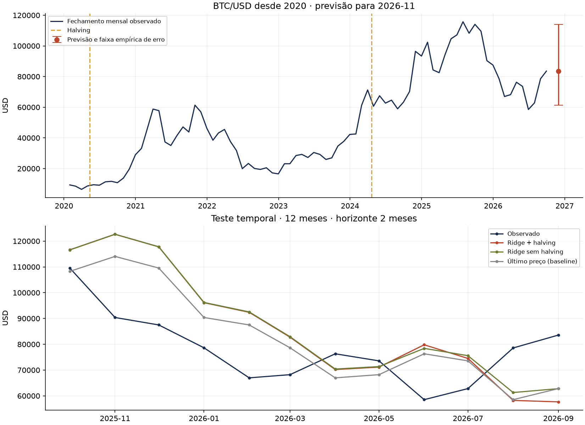
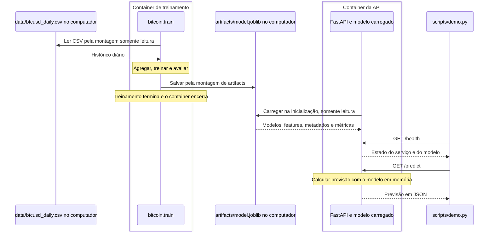

# Bitcoin: previsão mensal com Docker

**Autora:** Lorena Gabriela da Silva Garcia

**Atividade:** [modelo de predição com Docker — M7/2026](https://github.com/Murilo-ZC/Atividade-Ponderada-M7-2026-EC).

- A ideia é fazer uma solução em Python que agrega o histórico diário de **BTC/USD desde janeiro de 2020**. Escolhi esse começo por ter sido um ano de forte valorização do Bitcoin e um ano em que aconteceu o penúltimo halving da moeda, considerando a referência desta entrega. O fornecimento da previsão ocorre pelo backend FastAPI, por eu estar mais acostumada.

- O resultado previsto é o **preço de fechamento, em dólares, do último dia do próximo mês calendário**. A referência desta entrega é **05/10/2026**: o mês desejado é **novembro de 2026**, com fechamento em **30/11/2026**.

O texto abaixo organiza a explicação técnica por etapas, com assistência de IA. Os blocos de pedidos resumem o que cada etapa solicita ao código; não representam uma transcrição cronológica completa da conversa. O Dev Log pessoal fica ao final.

- **Primeiro, a origem dos dados.** Eu tô usando os dados do [CryptoDataDownload](https://www.cryptodatadownload.com/data/bitstamp/), porque já usei em outro projeto. O CSV utilizado contém **2.469 dias, de 01/01/2020 a 04/10/2026**, último dia observado integralmente na referência desta execução. Durante a execução pedi para a AI verificar o arquivo, ela descobriu que faltava o registro do dia **22/05/2026**, daí a solução foi puxar da API oficial da Bitstamp, que é a exchange de origem desse histórico.

Esse dia foi recuperado com o preço e o volume realmente registrados pela Bitstamp. A URL consultada, a resposta e os hashes ficam em [source.json](data/source.json), junto com a origem do CSV. O hash permite conferir se o arquivo usado no treinamento corresponde ao histórico documentado. As datas são calculadas pela coluna Unix em **UTC**, sem depender da coluna textual de datas do fornecedor.

- **Depois, a verificação e o agrupamento.** Eu pedi para a AI gerar o arquivo de verificação dos dados, era pra ser uma EDA, mas o trabalho dessa parte ficou concentrado na coleta, verificação e agrupamento pensando em mês. A análise exploratória mais ampla também poderia incluir distribuições e gráficos; aqui, o objetivo dessas funções é preparar uma base consistente para o treinamento.

O agrupamento ficou assim:

| Informação mensal | Como é calculada |
| --- | --- |
| Abertura | Primeira abertura do mês |
| Máxima | Maior preço máximo entre os dias |
| Mínima | Menor preço mínimo entre os dias |
| Fechamento | Último fechamento do mês |
| Volume | Soma do volume negociado em BTC |
| Volatilidade | Desvio padrão dos retornos logarítmicos diários |

A tabela também guarda a média dos fechamentos diários e a quantidade de dias observados. O resultado que queremos prever usa o **último fechamento**, não a média mensal.

Com isso, a preparação ficou em [data.py](bitcoin/data.py). Ele tem dois caminhos diretos:

| Caminho | Funções e resultado |
| --- | --- |
| Coleta e atualização | `download_history()` baixa o CSV, `parse_source()` organiza as colunas e `recover_missing_days()` recupera lacunas pela Bitstamp. Salva o CSV e sua origem. |
| Preparação para treino | `read_daily()` lê e verifica o CSV local; `aggregate_monthly()` agrupa os meses completos. |

As verificações rejeitam dias ausentes, datas duplicadas, valores inválidos, preços não positivos, volumes negativos e máximas ou mínimas inconsistentes. O treinamento usa o CSV salvo, então não precisa fazer outro download. Para outubro de 2026, os quatro dias disponíveis continuam no histórico diário, mas o mês inteiro fica fora do treino por ainda estar incompleto. Assim, ficam **81 meses completos, de janeiro de 2020 a setembro de 2026**.

- **Daí começamos a preparar as features.** Elas são os atributos que entram no modelo. A ideia é representar o comportamento recente do preço, do volume e a posição em relação ao halving:

| Atributos | Informação representada |
| --- | --- |
| Retornos de 1, 3 e 6 meses | Quanto o preço mudou em diferentes períodos |
| Distância das médias de 3 e 6 meses | Quanto o fechamento está acima ou abaixo da média recente |
| Amplitude relativa do mês | Diferença entre máxima e mínima, dividida pelo fechamento |
| Volatilidade diária | Intensidade das oscilações dentro do mês |
| Mudança do volume em escala logarítmica | Alteração da atividade negociada |
| Tempo desde o último halving | Posição temporal em relação ao evento |
| Subsídio por bloco em BTC | Quantidade de novos bitcoins por bloco naquele período |

Ao todo são **dez atributos disponíveis**: oito de mercado e dois relacionados ao halving. Eles são calculados em [features.py](bitcoin/features.py). Cada linha usa somente informações disponíveis até o fechamento daquele mês. Depois da comparação de alternativas descrita abaixo, o modelo de um mês passou a usar os oito atributos de mercado; o de dois meses continua usando os dez.

O halving aparece nas duas últimas variáveis da tabela. O código considera os eventos já ocorridos em cada data, incluindo **11/05/2020** e **20/04/2024 (UTC)**. No começo da série, o evento anterior, de 2016, ainda serve de referência. Isso representa o evento como informação de entrada; não obriga o modelo a prever uma alta depois dele. Mais adiante, o teste compara o resultado com e sem essas duas variáveis.

- **E aí, com essas duas fases dos dados prontas, vem a preparação do treinamento.** O pedido que descreve essa etapa é:

> Com os dados mensais e as features prontas, prepare os exemplos de treinamento. Cada exemplo deve usar as informações disponíveis até determinado mês para prever um fechamento futuro. Considere horizontes de um e dois meses, descarte linhas sem histórico suficiente e evite usar informações futuras nas entradas.

Na função `supervised()` de [train.py](bitcoin/train.py), cada exemplo liga as features de um mês ao fechamento futuro que queremos aprender a prever. Esse fechamento futuro serve como resposta do treinamento, não como entrada do modelo.

O alvo aprendido é o retorno logarítmico, que representa a mudança proporcional entre o fechamento de referência e o futuro. Depois, a previsão volta para dólares:

```text
alvo = log(fechamento futuro / fechamento de referência)
preço previsto = fechamento de referência × exp(retorno previsto)
```

As seis primeiras linhas mensais não têm histórico suficiente para calcular todos os atributos e são descartadas. As últimas linhas sem fechamento futuro conhecido também não servem como exemplos completos de treinamento. No ajuste final, ficam **74 exemplos para um mês e 73 para dois meses**. As features do último mês completo ficam guardadas para fazer a previsão futura.

Um detalhe dessa decisão é que **novembro é o próximo mês calendário em relação a outubro, mas fica dois meses depois de setembro**, que é o último mês completo disponível. Por isso existem dois modelos diretos: um prevê um mês à frente e outro prevê dois. Para novembro, usamos o segundo, sem precisar usar uma previsão de outubro como entrada.

- **Depois vem a escolha da Ridge.** A justificativa é o conjunto mensal pequeno, a presença de atributos relacionados entre si e a possibilidade de explicar o modelo lendo o código. O pedido correspondente é:

> Implemente o treinamento usando regressão Ridge. Antes do modelo, padronize os atributos com StandardScaler, ajustado somente nos dados de treinamento. Treine um modelo para cada horizonte, de um e dois meses. Mantenha o código simples e explique a função da regularização.

O `StandardScaler` coloca os atributos em escalas comparáveis, usando a média e o desvio padrão aprendidos no treino. Isso importa porque um retorno mensal e o número de meses desde o halving têm magnitudes diferentes, e a Ridge penaliza o tamanho dos coeficientes.

A [Ridge](https://scikit-learn.org/stable/modules/generated/sklearn.linear_model.Ridge.html) aprende uma relação linear entre os atributos e o retorno futuro, acrescentando uma penalização aos coeficientes. Essa regularização ajuda a controlar o ajuste ao histórico. Ela não elimina os ruídos do mercado nem garante uma previsão melhor.

No código, as duas operações ficam juntas para que a mesma transformação seja aplicada durante o treinamento e a previsão. O ajuste final usa `best_alpha`, que é o valor escolhido pela validação explicada na próxima etapa:

```python
pipeline = make_pipeline(StandardScaler(), Ridge(alpha=best_alpha))
pipeline.fit(samples[columns], samples["target_log_return"])
```

O parâmetro `alpha` controla a intensidade da penalização. Quanto maior ele é, maior a penalização aplicada aos coeficientes.

- **Daí precisamos escolher o alpha e conferir se o modelo consegue prever meses que não usou no ajuste.** O pedido para essa etapa é:

> Compare os valores de alpha 1, 10, 100 e 1.000 usando validação temporal, sem embaralhar os dados. Ajuste o StandardScaler somente no treinamento de cada divisão e escolha o alpha com menor erro absoluto médio do preço em dólares.

A função `tune_and_fit()` faz **três divisões cronológicas, com quatro meses de validação em cada uma**. Ela treina com os exemplos anteriores e compara as previsões com os fechamentos observados. A padronização é aprendida novamente dentro de cada divisão, usando somente o treino.

Além de respeitar a ordem dos meses, o código verifica se o resultado de cada exemplo já seria conhecido no momento da previsão. Para o horizonte de dois meses, existe uma linha de separação entre treino e validação (`gap=1`) para respeitar essa disponibilidade.

A comparação usa o **MAE em dólares**, que é a média da distância absoluta entre o valor previsto e o real. Por exemplo, erros de US$ 1.000, US$ 2.000 e US$ 3.000 resultam em MAE de US$ 2.000. O código escolhe o `alpha` com o menor MAE de validação.

- **Com isso, vem o teste histórico do modelo.** Escolher o parâmetro e avaliar o resultado são duas partes diferentes. O pedido que resume a avaliação é:

> Simule previsões para os 12 últimos meses com resultado conhecido. Em cada previsão, use somente o histórico que já estaria disponível naquela data. Compare a Ridge com halving, a Ridge sem halving e uma referência simples que repete o último fechamento. Registre as métricas e as previsões de cada mês.

A função `evaluate()` simula os meses alvo de **outubro de 2025 a setembro de 2026**, aumentando o histórico de treinamento a cada origem. A escolha do `alpha` acontece novamente dentro do histórico disponível em cada simulação. O resultado que está sendo previsto não participa dessa escolha.

A referência simples é chamada de **persistência**: se o último fechamento conhecido fosse US$ 80.000, a previsão dela também seria US$ 80.000. Essa comparação ajuda a verificar se o modelo acrescenta alguma capacidade de previsão. A versão sem halving ajuda a verificar se aquelas duas features melhoraram o resultado.

| Horizonte | Abordagem | MAE (USD) | RMSE (USD) | MAPE (%) | Acerto da direção (%) |
| --- | --- | ---: | ---: | ---: | ---: |
| 1 mês | Ridge + halving | 10.701,99 | 11.720,29 | 14,18 | 33,33 |
| 1 mês | Ridge sem halving | 10.118,93 | 11.573,08 | 13,50 | 41,67 |
| 1 mês | Persistência | **8.268,77** | **10.011,65** | **11,00** | 0,00 |
| 2 meses — usado para novembro | Ridge + halving | 17.897,24 | 20.179,91 | 23,45 | 25,00 |
| 2 meses | Ridge sem halving | 17.191,54 | 19.400,99 | 22,56 | 33,33 |
| 2 meses | Persistência | **14.475,46** | **16.062,22** | **19,23** | 0,00 |

Como o resultado previsto é um preço, a avaliação principal mede o tamanho dos erros. O **MAE** mostra a distância absoluta média em dólares, enquanto o **RMSE** dá mais peso aos erros grandes. O **MAPE** é o erro percentual absoluto médio em relação aos preços reais. Nos três casos, valores menores são melhores. Um MAPE de 23,45% não significa uma acurácia de 76,55%.

O **acerto da direção** verifica se a previsão acertou alta, queda ou estabilidade em relação ao fechamento conhecido na origem. Para o horizonte de dois meses, essa mudança é comparada ao preço de dois meses antes, não ao mês imediatamente anterior. A Ridge com halving acertou a direção em **3 das 12 previsões (25%)**. Já a persistência sempre prevê estabilidade e teve 0% porque nenhum desses resultados reais ficou exatamente igual ao preço de origem; isso não impede que ela tenha os menores erros de preço.

Esses números avaliam as previsões históricas de outubro de 2025 a setembro de 2026. Na referência de 05/10/2026, ainda não existe o fechamento observado de novembro para medir o erro daquela previsão futura.

Para mostrar as métricas diretamente do backend, com a API ligada:

```bash
curl --fail http://localhost:8000/metrics | python3 -m json.tool
```

Na resposta, a chave `"1"` contém a avaliação de um mês e a chave `"2"` contém a de dois meses, usada para discutir a previsão de novembro. A rota fornece as métricas do teste histórico salvas junto do modelo; essa consulta não executa outro treinamento. As métricas retornadas pela API foram conferidas com `results.json` e recalculadas a partir de `backtest.csv`.

O resultado foi que **a persistência teve menos erro nos dois horizontes, e incluir halving não melhorou a Ridge nesse recorte**. Então o sistema consegue treinar e fornecer a previsão, mas essa avaliação não demonstrou vantagem do modelo sobre a referência simples. A configuração usada pela API está identificada em `selected_model` nas métricas de cada horizonte: `ridge_without_halving` para um mês e `ridge_halving` para dois meses.

- **Depois, veio a tentativa de melhorar o modelo.** Para comparar alternativas, foi usado somente o histórico até **31/08/2025**, antes das origens das previsões da tabela anterior. O experimento avalia 12 meses alvo, de **setembro de 2024 a agosto de 2025**, e mantém o treinamento e a validação em ordem cronológica. O critério principal é diminuir o MAE em dólares.

As hipóteses foram retirar o halving, retirar o intercepto da Ridge, deixar a validação escolher entre essas opções e a persistência, e experimentar um modelo de árvores pequenas. Com as entradas padronizadas e centradas, o intercepto da Ridge representa a média histórica dos retornos de treinamento; retirá-lo aproxima as previsões de retorno zero para entradas próximas da média. Essa hipótese precisava ser testada, porque também pode piorar a previsão.

| Abordagem no desenvolvimento | MAE de 1 mês (USD) | MAE de 2 meses (USD) |
| --- | ---: | ---: |
| Ridge original, com halving e intercepto | 9.438,15 | **12.193,29** |
| Ridge sem halving | **9.155,81** | 14.177,88 |
| Ridge sem intercepto | 9.211,47 | 13.748,10 |
| Ridge sem intercepto nem halving | 9.454,80 | 14.688,85 |
| Validação escolhe alpha e intercepto | 9.685,01 | 14.268,29 |
| Validação escolhe Ridge original ou persistência | 9.653,82 | 13.934,90 |
| Validação escolhe alpha, intercepto ou persistência | 9.653,82 | 14.271,64 |
| Árvores pequenas com erro absoluto | 11.362,62 | 15.281,32 |
| Persistência | 9.177,67 | 13.410,67 |

O modelo de árvores usa uma configuração fixa de [HistGradientBoostingRegressor](https://scikit-learn.org/stable/modules/generated/sklearn.ensemble.HistGradientBoostingRegressor.html), registrada no código. Sua perda absoluta é calculada sobre o log-retorno, enquanto a comparação entre as abordagens usa o erro dos preços em dólares. Nenhuma dessas alternativas melhorou o horizonte de dois meses nesse desenvolvimento, então **o modelo usado para novembro foi mantido**.

Para um mês, retirar o halving reduziu o MAE de desenvolvimento em aproximadamente **2,99%**. A vantagem sobre a persistência foi pequena, de US$ 21,86, então esse resultado não demonstra uma superioridade robusta. A mudança aplicada foi restrita a esse horizonte: continua sendo `StandardScaler + Ridge`, usando oito atributos em vez de dez.

Na comparação retrospectiva de outubro/2025 a setembro/2026, a mudança de um mês reduz o MAE de **US$ 10.701,99 para US$ 10.118,93**, aproximadamente **5,45%**, e o MAPE de **14,18% para 13,50%**. Os acertos de direção passam de **4 para 5 em 12 previsões**. A persistência continua tendo menos erro. Esse período já tinha sido observado no projeto, portanto a comparação é retrospectiva, **não um novo teste independente**. Os números de desenvolvimento e os da tabela anterior pertencem a períodos diferentes; não representam, por si só, uma evolução de acurácia.

O experimento está em [compare.py](bitcoin/compare.py). Ele corta os dados antes de criar as features, imprime a comparação no terminal e não modifica o modelo nem cria novos relatórios. Para reproduzir em Docker, depois de construir a imagem:

```bash
docker compose --profile training run --rm train python -m bitcoin.compare
```

As nove abordagens foram executadas no ambiente local e em Docker, com os mesmos resultados. Para reproduzir localmente, com as dependências instaladas, use `python -m bitcoin.compare`. Esse módulo é opcional e não participa do atendimento das consultas da API.

- **Uma segunda pesquisa investigou perdas, regularização e uso do histórico.** As hipóteses foram definidas antes da execução desta rodada. A pesquisa se apoia nas explicações de [Huber](https://scikit-learn.org/stable/modules/generated/sklearn.linear_model.HuberRegressor.html), [regressão quantílica](https://scikit-learn.org/stable/modules/generated/sklearn.linear_model.QuantileRegressor.html), [combinações de previsões](https://otexts.com/fpp3/combinations.html), [janelas recentes](https://otexts.com/fpp3/long-short-ts.html) e [validação temporal](https://otexts.com/fpp3/tscv.html). Essas referências justificam os experimentos; não garantem melhoria para Bitcoin.

> Pesquise alternativas adequadas ao histórico mensal pequeno. Compare regressão robusta, outras formas de regularização, uma janela recente e a média entre Ridge e persistência. Mantenha os atributos e avalie o erro em dólares em vários trechos do histórico, registrando também as derrotas.

O protocolo usa **30 meses alvo, de março/2023 a agosto/2025**, divididos em **cinco blocos de seis meses**. O corte dos dados acontece antes do agrupamento mensal e das features. Em cada origem, entram no treinamento somente exemplos cujo fechamento futuro já seria conhecido. Todos os candidatos usam oito atributos em um mês e dez em dois meses, como a configuração atual da API.

Foram fixadas oito abordagens, incluindo as duas referências:

| Abordagem | Configuração definida antes da execução |
| --- | --- |
| Ridge atual | Histórico expansivo; alpha em 1, 10, 100 ou 1000 |
| Persistência | Repetir o fechamento de origem |
| Ridge recente | Até 36 exemplos de treinamento disponíveis; mesmos alphas |
| Média Ridge + persistência | Média aritmética dos dois preços, com pesos fixos de 50% |
| Huber | epsilon 1,35; alpha em 0,1, 1 ou 10 |
| ElasticNet | l1_ratio 0,5; alpha em 0,001, 0,01 ou 0,1 |
| BayesianRidge | Parâmetros padrão do scikit-learn |
| Regressão quantílica | Quantil 0,5; alpha em 0,001, 0,01 ou 0,1; retorno simples e pesos pelo preço de origem |

As regressões usam `StandardScaler`, ajustado apenas no treino. A escolha de alpha repete as três divisões temporais de quatro exemplos, com intervalo de `horizonte − 1`. A janela recente é aplicada ao histórico elegível antes dessas divisões. A média 50/50 reutiliza a Ridge atual, sem escolher pesos pelos resultados.

A regressão quantílica testa um alvo diferente: `retorno_simples = fechamento_futuro / fechamento_origem − 1`. O preço previsto é `fechamento_origem × (1 + retorno_previsto)`. Ao ponderar o erro absoluto desse retorno pelo fechamento de origem, a parte de erro da função de treinamento fica proporcional ao erro absoluto em dólares, além da penalização L1. Os pesos são normalizados pela média dos preços do treino. Os demais regressores continuam usando log-retorno. Previsões não positivas, não finitas e falhas de convergência são registradas; nenhum mês ruim é retirado para favorecer um candidato.

O critério definido para considerar uma substituição exige **MAE menor que a Ridge atual e a persistência no conjunto dos 30 meses**, além de vencer as duas simultaneamente em **pelo menos três dos cinco blocos**. Entre candidatos que atendam aos critérios, vence o menor MAE global. Esse critério é uma regra prática de consistência, não um teste de significância estatística. O período de outubro/2025 a setembro/2026 só é consultado depois de fixar a escolha de desenvolvimento.

Toda esta rodada continua sendo **pesquisa retrospectiva**, porque o histórico já foi usado em decisões anteriores. Mais tentativas também podem ajustar a própria seleção aos dados conhecidos, como discutem [Cawley e Talbot](https://jmlr.org/papers/v11/cawley10a.html). Uma redução histórica precisa ser acompanhada em meses novos.

**Resultados nos 30 meses de desenvolvimento:**

| Abordagem | MAE de 1 mês (USD) | MAE de 2 meses (USD) | Blocos vencendo ambas (1 mês / 2 meses) |
| --- | ---: | ---: | ---: |
| Ridge atual | 6.852,37 | 9.418,59 | Referência |
| Persistência | 6.708,90 | 9.206,13 | Referência |
| Ridge com janela de 36 exemplos | 6.734,13 | 11.355,93 | 0/5 · 0/5 |
| Média Ridge + persistência | 6.609,66 | 9.096,11 | 0/5 · 1/5 |
| Huber | 6.990,55 | 12.832,74 | 0/5 · 0/5 |
| ElasticNet | 6.897,77 | 9.442,81 | 1/5 · 2/5 |
| BayesianRidge | 6.497,45 | 9.120,68 | 1/5 · 2/5 |
| Regressão quantílica ponderada | 6.981,94 | 11.237,37 | 0/5 · 0/5 |

A BayesianRidge teve o menor MAE de desenvolvimento em um mês, e a média Ridge + persistência teve o menor em dois meses. Cada uma venceu as duas referências simultaneamente em somente **um dos cinco blocos**. Nenhuma alternativa cumpriu o critério de substituição, então os modelos da API foram mantidos. A regra não foi flexibilizada depois de observar os números.

A regressão quantílica encontrou **21 combinações de origem e alpha com previsão inválida na validação interna**, todas registradas no relatório. Esses parâmetros foram descartados; havia outras opções válidas em todas as origens. As oito abordagens foram avaliadas em todos os 30 alvos, sem excluir meses.

**Conferência retrospectiva dos candidatos com menor MAE de desenvolvimento, nos 12 alvos de outubro/2025 a setembro/2026:**

| Horizonte | Ridge atual: MAE (USD) | Candidato: MAE (USD) | Persistência: MAE (USD) |
| --- | ---: | ---: | ---: |
| 1 mês — BayesianRidge | 10.118,93 | 9.319,17 | 8.268,77 |
| 2 meses — média 50/50 | 17.897,24 | 16.079,26 | 14.475,46 |

Nessa conferência, a BayesianRidge reduziu o MAE em **7,90%** frente à Ridge atual, com MAPE de **12,25%** e os mesmos **5 acertos de direção em 12**. A média 50/50 reduziu o MAE de dois meses em **10,16%**, com MAPE de **21,24%** e os mesmos **3 acertos em 12**. Ambas continuaram com mais erro que a persistência. Esses percentuais comparam modelos no mesmo período; não comparam o período recente com os 30 meses de desenvolvimento.

O experimento está em [research.py](bitcoin/research.py), um módulo opcional que imprime parâmetros, métricas, resultados por bloco, falhas e todas as previsões usadas nas contas. Ele não participa da API, não altera `model.joblib` ou `results.json` e não adiciona relatórios JSON ao projeto. A implementação usa as dependências já existentes. Para reproduzir os dois períodos:

```bash
docker compose build
docker compose --profile training run --rm train python -m bitcoin.research --retrospective
```

Sem `--retrospective`, o comando avalia apenas o desenvolvimento. Localmente, com as dependências instaladas, use `python -m bitcoin.research --retrospective`. A execução local e a execução em Docker produziram relatórios idênticos. O `results.json` continua documentando os modelos efetivamente usados pela API; os candidatos permanecem como pesquisa. A previsão de novembro e sua faixa de erro não mudaram.

- **Depois da avaliação, o treinamento ajusta os modelos com todos os exemplos disponíveis e salva os arquivos.** No ajuste final, a validação escolheu `alpha=1` para os dois horizontes. As colunas realmente utilizadas ficam em `metadata.fit`: oito no horizonte de um mês e dez no de dois meses. O valor de alpha é do ajuste final; ele pode ser diferente dos valores escolhidos nas simulações históricas. A faixa de erro de cada horizonte é calculada com as previsões históricas da configuração usada por ele.

> Salve os modelos treinados e a padronização para que o backend consiga carregar e prever. Reúna os metadados, as métricas e a previsão em results.json e mantenha source.json para documentar a origem dos dados.

| Arquivo | Pra que serve |
| --- | --- |
| [model.joblib](artifacts/model.joblib) | Guarda os modelos, a padronização, as últimas features, os metadados e as métricas usados pela API. |
| [results.json](artifacts/results.json) | Reúne `metadata`, `metrics` e `forecast` em um relatório legível. |
| [monthly.csv](artifacts/monthly.csv) | Mostra a tabela mensal gerada a partir dos dados diários. |
| [backtest.csv](artifacts/backtest.csv) | Guarda o valor observado e as previsões de cada mês do teste. |
| [evaluation.png](artifacts/evaluation.png) | Mostra o histórico, a previsão e a comparação entre os modelos. |

O [source.json](data/source.json) fica junto dos dados e documenta sua origem. Assim, há dois arquivos JSON no projeto, cada um com uma função. Quem guarda os modelos que serão executados é o `model.joblib`; o `results.json` serve para consultar os resultados.

A previsão registrada para **30/11/2026 é US$ 83.568,56**. A variação de **0,01%** compara esse valor com o fechamento de setembro, **US$ 83.562,58**, e não com uma cotação atual de outubro.

A faixa de **US$ 61.285,68 a US$ 113.953,29** usa o quantil de 80% dos erros absolutos logarítmicos do teste. É uma referência empírica de erro, calculada com apenas 12 exemplos, e não uma garantia de 80% de chance de o preço ficar dentro dela. Os erros de períodos sobrepostos também não são independentes.



- **Com o modelo salvo, vem o backend em FastAPI.** O pedido dessa etapa é:

> Crie uma API em FastAPI que carregue o model.joblib ao iniciar e disponibilize a previsão em /predict. Inclua /health para verificar se o serviço está pronto, /metrics para consultar a avaliação e /model para consultar os metadados.

Isso está em [api.py](bitcoin/api.py). Quando a aplicação inicia, ela carrega o artefato uma vez e guarda o conteúdo na memória. Se o arquivo estiver ausente ou inválido, o serviço responde com erro **503**, inclusive na consulta de saúde.

O cálculo fica em [forecast.py](bitcoin/forecast.py), para que a API e o treinamento usem a mesma função de previsão. Ela identifica o horizonte solicitado, organiza as features salvas usando as colunas do modelo daquele horizonte, chama o modelo e transforma o retorno previsto em preço. A resposta de um mês informa `sem halving` e devolve `halving_features` vazio; a de dois meses continua informando as duas variáveis utilizadas.

```text
Requisição → api.py → forecast.predict() → modelo treinado → resposta JSON
```

| Rota | O que retorna |
| --- | --- |
| `GET /health` | Indica se o serviço conseguiu carregar um modelo utilizável. |
| `GET /predict` | Previsão para novembro de 2026, padrão deste artefato. |
| `GET /predict?target_month=2026-11` | Solicita explicitamente um mês suportado. |
| `GET /metrics` | Métricas registradas durante o treinamento. |
| `GET /model` | Metadados e configuração do modelo. |
| `GET /docs` | Documentação interativa gerada pelo FastAPI. |

Esse artefato suporta outubro e novembro de 2026. Um mês inválido ou fora dos horizontes recebe erro **422**. A API não baixa dados nem treina a cada requisição: ela lê o `model.joblib` e calcula com o que foi salvo. Por isso, depois de atualizar os dados e treinar novamente, precisamos reiniciar a API para carregar o novo modelo.

- **Aí chegamos ao Docker, que coloca o treinamento e a API em ambientes separados.** O pedido que descreve essa parte é:

> Crie um Dockerfile com Python e as dependências do projeto. No Docker Compose, configure um serviço para executar o treinamento e outro para manter a API funcionando. Faça o modelo gerado no treinamento chegar à API por uma pasta compartilhada e deixe os comandos de execução documentados.

O diagrama UML de sequência abaixo mostra como o modelo chega ao backend. Ele fica no próprio README, em Mermaid, para ser exibido no GitHub:



O [Dockerfile](Dockerfile) define a **imagem**, que é a base usada para criar os containers. Ela parte de `python:3.13-slim`, instala as versões de bibliotecas registradas em [requirements.txt](requirements.txt) e copia a pasta `bitcoin/` para dentro da imagem. O diretório de trabalho é `/app`.

As dependências são copiadas e instaladas antes do código. Isso permite reaproveitar essa etapa da construção quando só o código muda. O processo roda com um usuário sem privilégios de administrador. O comando padrão inicia o Uvicorn, que é o servidor que executa a aplicação FastAPI.

O [compose.yaml](compose.yaml) descreve os dois serviços. Eles usam **a mesma imagem**, mas executam comandos e funções diferentes:

| Serviço | Comando principal | O que acontece |
| --- | --- | --- |
| `train` | `python -m bitcoin.train --as-of 2026-10-05` | Lê os dados, treina, avalia, salva os artefatos e encerra. |
| `api` | `python -m uvicorn bitcoin.api:app --host 0.0.0.0 --port 8000` | Carrega o modelo e continua disponível para receber requisições. |

O serviço `train` fica no perfil `training`, então sua execução é solicitada explicitamente. O comando dele substitui o comando padrão da imagem; o serviço `api` usa o comando padrão do Dockerfile.

- **A ligação entre os dois containers é a pasta `artifacts/`.** O Compose monta pastas do computador dentro dos containers, usando os volumes:

| Montagem | Serviço e acesso |
| --- | --- |
| `./data:/app/data:ro` | O treinamento lê o histórico sem modificar os dados. |
| `./artifacts:/app/artifacts` | O treinamento grava os modelos e relatórios na pasta do computador. |
| `./artifacts:/app/artifacts:ro` | A API lê os artefatos, sem permissão para gravar nessa pasta. |

O `:ro` significa somente leitura. Como o modelo fica na pasta do computador, ele continua existindo depois que o container de treinamento é removido. A API acessa esse mesmo arquivo pela montagem, então não precisa receber o modelo por uma chamada HTTP nem ter os dados de treinamento dentro dela.

O mapeamento `127.0.0.1:8000:8000` disponibiliza a porta 8000 do container na porta 8000 do computador, acessível localmente. Dentro do container, o Uvicorn escuta em `0.0.0.0` para receber as conexões encaminhadas. O `EXPOSE 8000` do Dockerfile apenas informa a porta; quem a publica é o Compose. O `healthcheck` consulta `/health` para verificar se a API está pronta.

- **Com isso, a execução em Docker segue esta ordem.** É preciso ter Docker com Compose e internet para construir a imagem. Os comandos são executados na raiz do projeto. O CSV já fornecido permite treinar sem baixar o histórico novamente.

```bash
mkdir -p artifacts
export LOCAL_UID=$(id -u)
export LOCAL_GID=$(id -g)
export AS_OF=2026-10-05
docker compose build
docker compose --profile training run --rm train
docker compose up -d --wait api
```

No Linux, `LOCAL_UID` e `LOCAL_GID` fazem os arquivos gerados pertencerem ao usuário local. `AS_OF` fixa a data de referência da análise.

O `build` constrói a imagem. O `run --rm train` executa o treinamento e remove seu container depois que ele termina; os artefatos continuam na pasta compartilhada. O `up -d --wait api` inicia o backend em segundo plano e aguarda o serviço ficar saudável. O treinamento deve terminar com sucesso antes da inicialização da API.

- **Por último, a demonstração confere se uma requisição chega ao backend e volta com a previsão.** Para acompanhar o serviço e fazer as consultas:

```bash
docker compose ps
curl --fail http://localhost:8000/health
curl --fail 'http://localhost:8000/predict?target_month=2026-11'
curl --fail http://localhost:8000/metrics
python3 scripts/demo.py
```

O script [demo.py](scripts/demo.py) é o cliente da demonstração: consulta `/health` e `/predict` por HTTP e imprime as respostas reais no terminal. Depois de iniciar ou reiniciar a API, ele espera até 30 segundos pela resposta de saúde antes de pedir a previsão. Durante essa espera, tenta novamente em caso de falha de conexão ou HTTP 503; outros erros HTTP são apresentados imediatamente. Ele não cria outro arquivo de relatório. A documentação interativa está em `http://localhost:8000/docs`.

Alguns campos da previsão registrada em `results.json`, no mesmo formato usado pela API, são:

```json
{
  "target_month": "2026-11",
  "target_date": "2026-11-30",
  "last_complete_month": "2026-09",
  "horizon_months": 2,
  "predicted_close_usd": 83568.56
}
```

Na validação desta versão, passaram **50 testes automatizados em 6,08 segundos**. Além dos fluxos de dados, treinamento, API e cliente, eles verificam o corte temporal da pesquisa, a equivalência da Ridge de referência, a janela recente, a ponderação da regressão quantílica, o registro de falhas e a regra de seleção por blocos. A pesquisa foi executada localmente e em Docker, com relatórios idênticos. Consultas reais a `/health`, `/predict` e `/metrics` confirmaram que a API continua saudável e com os mesmos resultados. Nesta rodada, os dados, artefatos e código de produção permaneceram idênticos: a API mantém Ridge sem halving em um mês e com halving em dois meses.

Os testes conferem preparação dos dados, treinamento e comportamento da API. O teste histórico mede a qualidade das previsões. Um sistema passar nos testes de funcionamento não significa que seu modelo tenha pouco erro de previsão.

Depois de um novo treinamento, reinicie a API para carregar o modelo atualizado e execute a demonstração:

```bash
docker compose restart api
python3 scripts/demo.py
```

Reiniciar o container e ter a aplicação pronta são momentos diferentes. A primeira consulta pode encontrar a conexão encerrada enquanto o servidor carrega o modelo. A função `wait_for_api()` do cliente aguarda a resposta de `/health` antes de continuar. Se o prazo acabar, o script mostra uma mensagem de erro e encerra; confira `docker compose logs api` para investigar.

Para encerrar os serviços, use `docker compose down`; os dados e artefatos continuam nas pastas locais.

## Atualizar os dados e executar localmente

O ambiente local ajuda no desenvolvimento e nos testes. A demonstração da atividade também inclui os containers descritos acima.

```bash
python3 -m venv .venv
source .venv/bin/activate
python -m pip install -r requirements-dev.txt
python -m pytest
```

Para atualizar o recorte, use a mesma data de referência na coleta e no treinamento. Esses comandos reproduzem a referência da entrega; para uma nova análise, troque as datas explicitamente:

```bash
python -m bitcoin.data --output data/btcusd_daily.csv --as-of 2026-10-05
AS_OF=2026-10-05 docker compose --profile training run --rm train
docker compose restart api
```

A fonte pode revisar dados antigos e alterar os resultados de um novo download. O CSV e o `source.json` devem ser preservados junto dos artefatos da execução que será apresentada.

Também é possível executar o treinamento e a API localmente:

```bash
python -m bitcoin.train --as-of 2026-10-05
python -m uvicorn bitcoin.api:app --host 127.0.0.1 --port 8000
```

A porta 8000 precisa estar livre. Em outro terminal, `python3 scripts/demo.py` demonstra a consulta. As opções `--url` e `--target-month` permitem informar outro endereço e um mês suportado.

## Limitações e entrega

- A amostra mensal é pequena e contém poucos ciclos de halving. A comparação mede associação preditiva nesse recorte e não identifica causalidade.
- Preços e volumes vêm de uma exchange; o volume não representa toda a demanda global por Bitcoin.
- O modelo não incorpora notícias futuras, juros futuros ou outros acontecimentos que ainda não ocorreram. Ele também não recebe cotações em tempo real.
- O mês parcial fica fora das features, e a data alvo permanece vinculada à referência do modelo salvo.
- A avaliação teve apenas 12 meses por horizonte, com resultado inferior à persistência. As previsões são experimentais e não representam recomendação de investimento.

| Critério da atividade | Evidência no projeto |
| --- | --- |
| Solução funcionando — 40% | UML, treinamento em container, artefato exportado, API em outro container e cliente de demonstração. |
| Dev Log — 40% | Registros pessoais da autora, com decisões, dificuldades, comandos e resultados observados. |
| Observações do professor — 20% | Participação e capacidade de explicar as escolhas durante a atividade. |

A entrega deve estar em um **repositório público próprio no GitHub**. O link da atividade no início deste documento é o enunciado do professor. A autora precisa conferir o acesso ao seu repositório e apresentar a demonstração.

## Uso de IA

Implementação e documentação técnica elaboradas com assistência do **Codex**, incluindo dados, modelagem, API, Docker, diagrama e verificações. A organização por etapas e os pedidos usados para explicar o código também tiveram assistência de IA. O texto técnico não substitui os registros pessoais de desenvolvimento.

**Declaração pessoal da autora sobre uso de IA:** _preencher sem reescrita por IA._

## Dev Log pessoal

**Esta seção deve ser escrita pela autora durante o trabalho.** Conforme a orientação do professor, os relatos pessoais não devem ser escritos, corrigidos ou reescritos por IA. Os campos abaixo são somente um modelo vazio; não constituem evidência de etapas realizadas.

### Registro — preencher data e horário reais

- O que decidi fazer e por quê:
- O que eu entendi sobre a arquitetura e o modelo:
- Comando, alteração ou teste que executei:
- Resultado observado, dificuldade ou erro:
- O que mudei e qual será meu próximo passo:
- Como utilizei IA nesta etapa:

_Acrescentar novos registros conforme o desenvolvimento ocorrer, preservando as próprias palavras._
